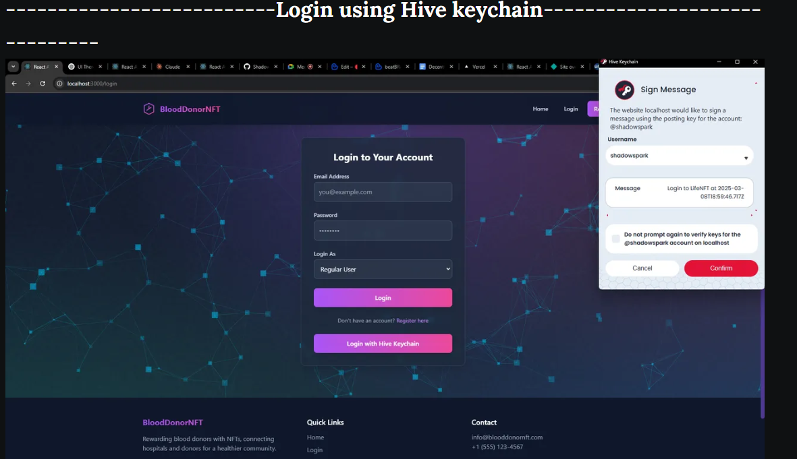
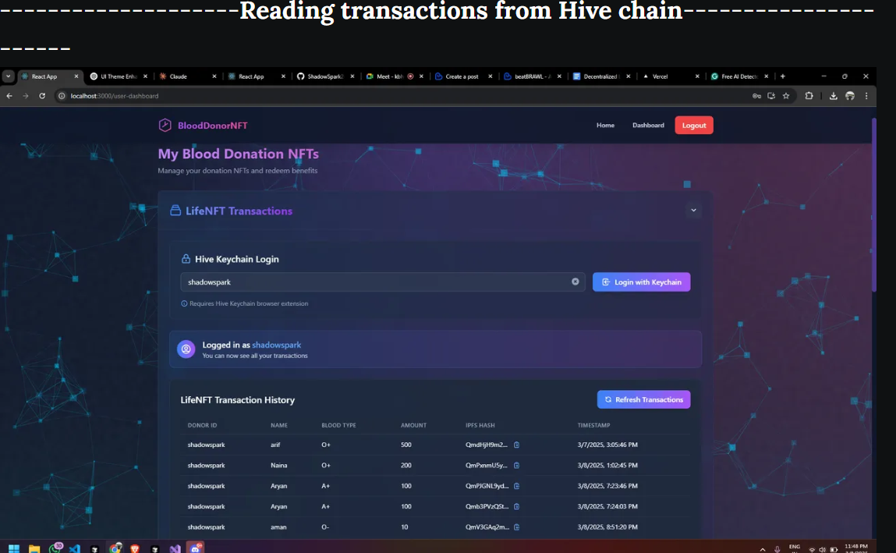
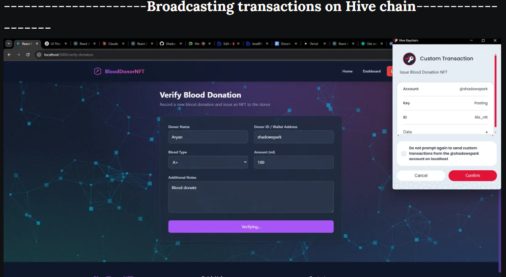

# BloodDonorNFT

**BloodDonorNFT** is a **Hive blockchain-powered** platform that incentivizes blood donation by rewarding donors with unique NFTs. This project seamlessly integrates **HiveAuth, Hive blockchain data reading, and Hive transaction broadcasting**, ensuring a **secure, decentralized, and transparent** blood donation ecosystem.

## Overview
BloodDonorNFT addresses the global challenge of blood shortages by leveraging **Hive blockchain** for immutable donation verification and NFT-based rewards. Hospitals validate donations, and donors receive **Hive-backed digital certificates (NFTs)** that can later be redeemed for benefits.

## Hive Blockchain Integration

BloodDonorNFT fully utilizes the **Hive blockchain** for:

**HiveAuth Authentication** – Secure, decentralized login for users
**Hive Blockchain Data Read** – Real-time retrieval of donation records and verification status
**Hive Transaction Broadcasting** – Trustless and transparent recording of donation events on-chain

## Screenshots


=================================================================================



=================================================================================



## Features
- **Multi-Role System** – Separate dashboards for **government agencies, hospitals, and blood donors**
- **Blockchain Verification** – Transparent and secure recording of donation history on **Hive blockchain**
- **NFT Rewards** – Donors receive **Hive-based digital certificates** as NFTs
- **Donation Tracking** – Complete donation history stored and verified via **Hive blockchain**
- **Hospital Management** – Government agencies can **approve and oversee hospitals**
- **Mobile Responsive** – Fully optimized for all devices

## Technology Stack
- **Frontend**: React.js with React Router
- **Styling**: Tailwind CSS with custom animations
- **UI Components**: Custom-built, mobile-friendly design
- **Authentication**: **HiveAuth-based authentication** for secure access
- **Blockchain**: **Hive blockchain for data integrity, NFT issuance, and transaction broadcasting**
- **Visual Effects**: Modern UI with particle background

This project was developed as part of the **Hive Blockchain Hackathon**, demonstrating a real-world application of **Hive blockchain** in healthcare and donor incentivization. 🚀

## Revenue Model  

- Government Collaborations & Service Fees

   - Partnering with government bodies and hospitals to implement blockchain-based donation tracking.

   - Charging a small fee per NFT-based donor certificate issuance.

- Institutional Partnerships & API Access

   - Offering paid API access for universities, online course providers, and NGOs.

   - Selling white-label blockchain solutions for institutions needing verifiable credentials.

- NFT-Based Course Redemption Fees

   - Charging a small transaction fee when users redeem their NFTs for educational courses.

   - Offering premium courses where additional NFTs or payments may be required.

- Corporate Sponsorship & CSR Funding

   - Partnering with companies for CSR-driven blood donation and education programs.

   - Charging sponsorship fees to brands supporting social-impact initiatives.

- Future NFT Marketplace

   - Creating a marketplace for NFT-based learning achievements where users can trade, showcase, or upgrade their educational credentials.

   - Monetizing through transaction fees and premium NFT issuance.

## Getting Started

### Prerequisites

- Node.js (v14 or higher)
- npm or yarn
- Hive Keychain wallet for NFT transactions

### Installation

1. Clone the repository:
   ```bash
   git clone https://github.com/ShadowSpark243/lifenft.git
   cd lifenft
   ```

2. Install dependencies:
   ```bash
   npm install
   ```

3. Start the development server:
   ```bash
   npm start
   ```

4. The application will be available at `http://localhost:3000`


## User Roles

### Government Agency
- Approve and manage hospital registrations
- View donation statistics and analytics
- Configure system parameters

### Hospital
- Verify blood donations
- Issue NFT certificates to donors
- Manage donation records

### Blood Donor
- Register and manage profile
- View donation history
- Redeem NFT rewards


## Contributing

We welcome contributions to the BloodDonorNFT project. Please read our [CONTRIBUTING.md](CONTRIBUTING.md) file for guidelines on how to make contributions.

## License

This project is licensed under the MIT License - see the [LICENSE.md](LICENSE.md) file for details.

## Contact

- Email: arifakhtar902@gmail.com

## Acknowledgments

- Blood donation centers worldwide for their invaluable service
- The blockchain and NFT communities for inspiration
- Our development team and early adopters
